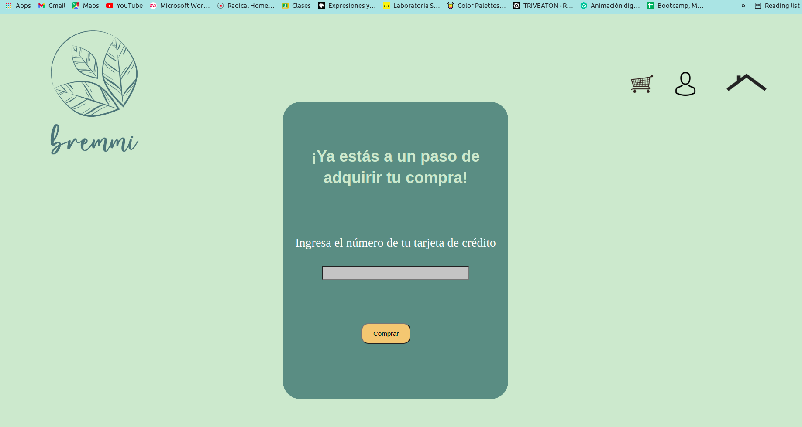
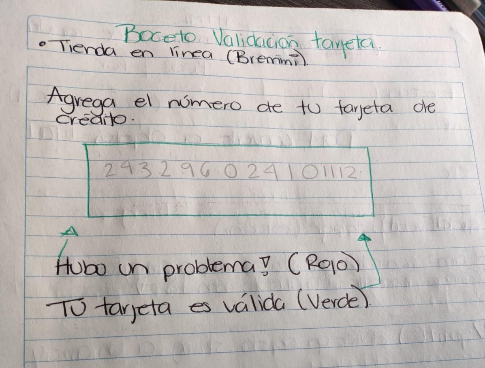
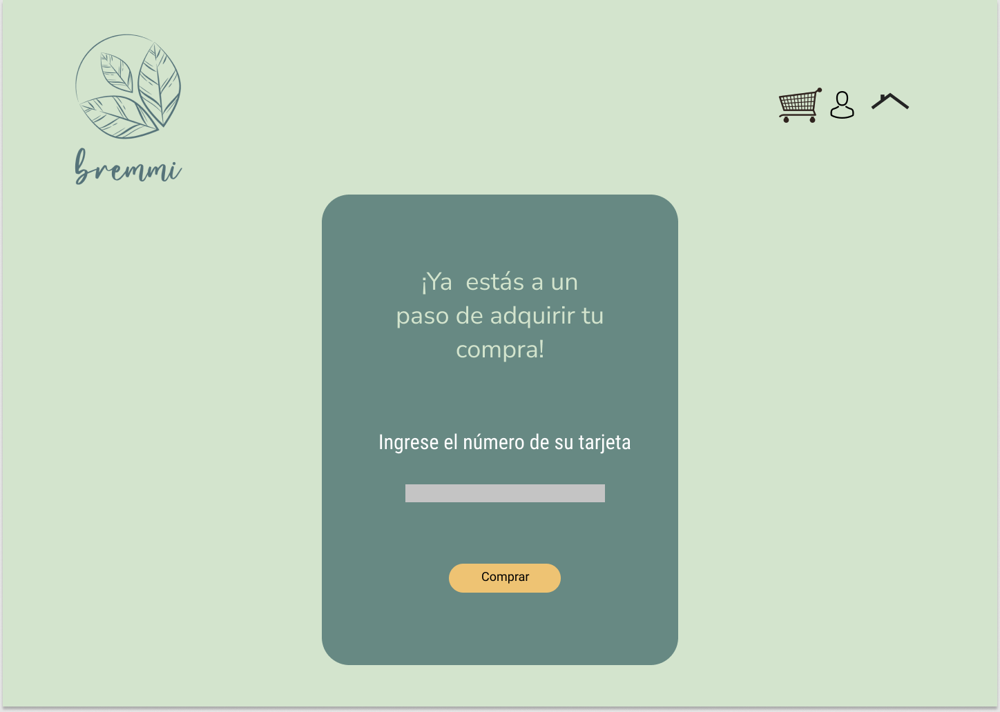

# Card Validation Bremmi

## 1. Resumen del proyecto.

En este apartado el usuario podrá validar su tarjeta de crédito metiendo sus dígitos en la casilla para poder comprar artículos en la tienda en línea de la marca Bremmi.

## 2. Investigación UX

Los usuarios son personas que consumen alimentos veganos y quieren comprar en la tienda en línea.

El producto soluciona un problema fundamental que es poder validar su tarjeta para comprar los  productos desde la comodidad de su casa por medio de la página web y así no tener que trasladarse a los puntos de venta.Recibiendo sus productos hasta la puerta de su casa.

## 3. Primer feedback:
Mis compañeras del squad me dijeron que como primer acercamiento al proyecto estaba bien, pero qué debía pensar en lo visual para el usuario, que tuviera colores adecuados y mucha claridad de en qué apartado están y qué debe hacer el usuario.

## 4.Boceto a lápiz

## 5.Prototipo en Figma
